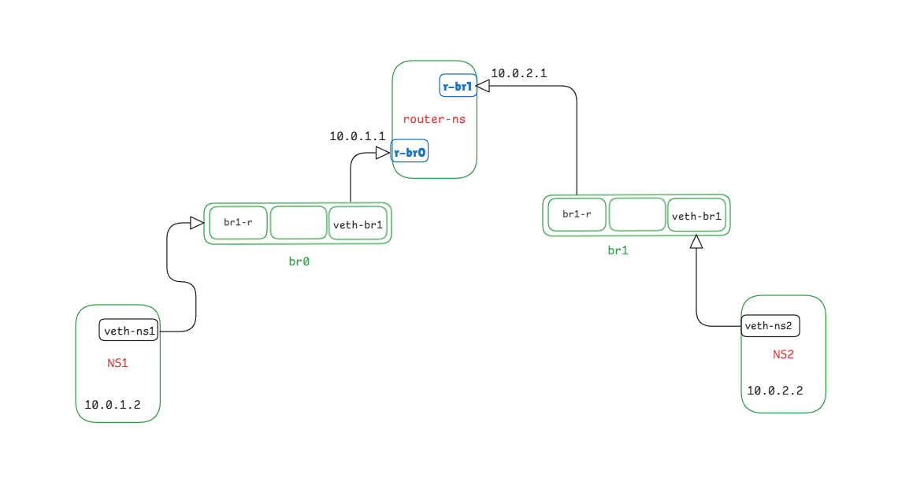

# Linux-Network-Namespace-Simulation


##  Objective

The objective of this lab is to simulate two isolated networks connected via a router using Linux network namespaces, virtual Ethernet interfaces (veth), and bridges.

---

##  Network Topology

```
ns1 ── veth ── br0 ── router-ns ── br1 ── veth ── ns2
```

* **ns1** → Network 1
* **ns2** → Network 2
* **router-ns** → Acts as a router between two networks
* **br0 / br1** → Virtual switches (bridges)

---

##  Components Used

### 🔹 Network Namespaces

* ns1
* ns2
* router-ns

### 🔹 Bridges

* br0
* br1

### 🔹 Virtual Interfaces (veth pairs)

* ns1 ↔ br0
* ns2 ↔ br1
* router ↔ br0
* router ↔ br1

---
## 🧠 Network Diagram



---
##  IP Addressing Scheme

| Device    | Interface | IP Address  | Network     |
| --------- | --------- | ----------- | ----------- |
| ns1       | veth-ns1  | 10.0.1.2/24 | 10.0.1.0/24 |
| router-ns | r-br0     | 10.0.1.1/24 | 10.0.1.0/24 |
| ns2       | veth-ns2  | 10.0.2.2/24 | 10.0.2.0/24 |
| router-ns | r-br1     | 10.0.2.1/24 | 10.0.2.0/24 |

---

##  Implementation Steps

### 1️⃣ Create Bridges

```bash
ip link add br0 type bridge
ip link add br1 type bridge
ip link set br0 up
ip link set br1 up
```

---

### 2️⃣ Create Namespaces

```bash
ip netns add ns1
ip netns add ns2
ip netns add router-ns
```

---

### 3️⃣ Create veth Pairs and Attach

```bash
# ns1 ↔ br0
ip link add veth-ns1 type veth peer name veth-br0
ip link set veth-ns1 netns ns1
ip link set veth-br0 master br0
ip link set veth-br0 up

# ns2 ↔ br1
ip link add veth-ns2 type veth peer name veth-br1
ip link set veth-ns2 netns ns2
ip link set veth-br1 master br1
ip link set veth-br1 up

# router ↔ br1
ip link add br1-r type veth peer name r-br1
ip link set br1-r master br1
ip link set r-br1 netns router-ns
ip link set br1-r up

# router ↔ br0
ip link add br0-r type veth peer name r-br0
ip link set br0-r master br0
ip link set r-br0 netns router-ns
ip link set br0-r up
```

---

### 4️⃣ Bring Interfaces Up

```bash
# ns1
ip netns exec ns1 ip link set lo up
ip netns exec ns1 ip link set veth-ns1 up

# ns2
ip netns exec ns2 ip link set lo up
ip netns exec ns2 ip link set veth-ns2 up

# router
ip netns exec router-ns ip link set lo up
ip netns exec router-ns ip link set r-br0 up
ip netns exec router-ns ip link set r-br1 up
```

---

### 5️⃣ Assign IP Addresses

```bash
# ns1
ip netns exec ns1 ip addr add 10.0.1.2/24 dev veth-ns1

# ns2
ip netns exec ns2 ip addr add 10.0.2.2/24 dev veth-ns2

# router
ip netns exec router-ns ip addr add 10.0.1.1/24 dev r-br0
ip netns exec router-ns ip addr add 10.0.2.1/24 dev r-br1
```

---

### 6️⃣ Configure Routing

```bash
# ns1 default route
ip netns exec ns1 ip route add default via 10.0.1.1

# ns2 default route
ip netns exec ns2 ip route add default via 10.0.2.1
```

---

### 7️⃣ Enable IP Forwarding (Router)

```bash
ip netns exec router-ns sysctl -w net.ipv4.ip_forward=1
```

---

### 8️⃣ Fix Bridge Packet Filtering (Important)

```bash
sysctl -w net.bridge.bridge-nf-call-iptables=0
sysctl -w net.bridge.bridge-nf-call-ip6tables=0
sysctl -w net.bridge.bridge-nf-call-arptables=0
```

---

##  Testing Connectivity

### 🔹 Test same network

```bash
ip netns exec ns1 ping 10.0.1.1
```

### 🔹 Cross-network test

```bash
ip netns exec ns1 ping 10.0.2.2
ip netns exec ns2 ping 10.0.1.2
```

---

##  Results

* ns1 → ns2 communication successful ✔
* ns2 → ns1 communication successful ✔
* Routing between networks works correctly ✔

---

##  Common Issues Faced

###  Issue: Ping not working

* Cause: IP assigned with `/32`
* Fix: Use `/24`

###  Issue: Gateway unreachable

* Cause: Missing default route

###  Issue: Bridge not forwarding packets

* Cause: bridge netfilter enabled
* Fix:

```bash
sysctl -w net.bridge.bridge-nf-call-iptables=0
```

---

##  Cleanup Commands

```bash
ip netns del ns1
ip netns del ns2
ip netns del router-ns

ip link del br0
ip link del br1
```

---

#  Automation (Bash Script)

##  Overview

To simplify and streamline the setup process, the entire network configuration can be automated using a Bash script. This eliminates the need to manually execute multiple commands and ensures consistency and repeatability.

---

##  Objective of Automation

* Reduce manual configuration effort
* Avoid human errors during setup
* Enable one-command deployment
* Improve reproducibility of the lab environment

---

##  Setup Script (`setup.sh`)

Create a file named `setup.sh` and add the following content:

```bash
#!/bin/bash

echo "Creating bridges..."
ip link add br0 type bridge
ip link add br1 type bridge
ip link set br0 up
ip link set br1 up

echo "Creating namespaces..."
ip netns add ns1
ip netns add ns2
ip netns add router-ns

echo "Creating veth pairs..."

# ns1 ↔ br0
ip link add veth-ns1 type veth peer name veth-br0
ip link set veth-ns1 netns ns1
ip link set veth-br0 master br0
ip link set veth-br0 up

# ns2 ↔ br1
ip link add veth-ns2 type veth peer name veth-br1
ip link set veth-ns2 netns ns2
ip link set veth-br1 master br1
ip link set veth-br1 up

# router ↔ br0
ip link add br0-r type veth peer name r-br0
ip link set br0-r master br0
ip link set r-br0 netns router-ns
ip link set br0-r up

# router ↔ br1
ip link add br1-r type veth peer name r-br1
ip link set br1-r master br1
ip link set r-br1 netns router-ns
ip link set br1-r up

echo "Bringing interfaces up..."

# ns1
ip netns exec ns1 ip link set lo up
ip netns exec ns1 ip link set veth-ns1 up

# ns2
ip netns exec ns2 ip link set lo up
ip netns exec ns2 ip link set veth-ns2 up

# router
ip netns exec router-ns ip link set lo up
ip netns exec router-ns ip link set r-br0 up
ip netns exec router-ns ip link set r-br1 up

echo "Assigning IP addresses..."

# ns1
ip netns exec ns1 ip addr add 10.0.1.2/24 dev veth-ns1

# ns2
ip netns exec ns2 ip addr add 10.0.2.2/24 dev veth-ns2

# router
ip netns exec router-ns ip addr add 10.0.1.1/24 dev r-br0
ip netns exec router-ns ip addr add 10.0.2.1/24 dev r-br1

echo "Configuring routes..."

ip netns exec ns1 ip route add default via 10.0.1.1
ip netns exec ns2 ip route add default via 10.0.2.1

echo "Enabling IP forwarding..."
ip netns exec router-ns sysctl -w net.ipv4.ip_forward=1

echo "Disabling bridge netfilter..."
sysctl -w net.bridge.bridge-nf-call-iptables=0
sysctl -w net.bridge.bridge-nf-call-ip6tables=0
sysctl -w net.bridge.bridge-nf-call-arptables=0

echo "Setup complete!"
```

---

##  How to Run

### 1. Make the script executable

```bash
chmod +x setup.sh
```

### 2. Execute the script

```bash
sudo ./setup.sh
```

---

##  Verification

After running the script, test connectivity:

```bash
sudo ip netns exec ns1 ping 10.0.2.2
```

Expected result:

* Successful ICMP replies from `ns2`

---

##  Cleanup Script (`cleanup.sh`)

To reset the environment, create a cleanup script:

```bash
#!/bin/bash

echo "Cleaning up..."

ip netns del ns1
ip netns del ns2
ip netns del router-ns

ip link del br0
ip link del br1

echo "Cleanup complete!"
```

---

##  Run Cleanup

```bash
chmod +x cleanup.sh
sudo ./cleanup.sh
```

---

##  Benefits of Automation

* One-command full setup
* Faster lab deployment
* Easy teardown and reset
* Suitable for repeated testing and demos

---


##  Conclusion

This project demonstrates:

* Network isolation using namespaces
* Layer 2 connectivity using bridges
* Layer 3 routing using a virtual router
* Troubleshooting real-world networking issues (ARP, routing, filtering)

---

